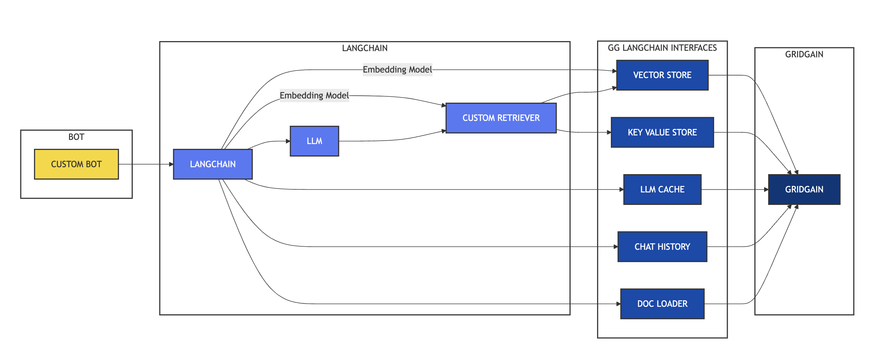

# gg8_langchain_demo

gg_langchain_demo is a demonstration project that showcases the integration of GridGain/Apache Ignite with LangChain, using the custom langchain_gridgain package. This project provides examples of how to use GridGain as a backend for various LangChain components, particularly focusing on a laptop recommendation system.

## Table of Contents
1. [Features](#features)
2. [Architecture & Project Structure](#architecture--project-structure)
3. [Prerequisites](#prerequisites)
4. [Installation](#installation)
5. [Usage](#usage)
6. [Initialization](#initialization)
7. [Components Used](#components-used)

## Features

- GridGain-based key-value store, chat history, LLM cache, and document loader
- Document Loader (GridGain) for managing reviews of the laptops
- Key Value Store (GridGain) for managing specs of the laptops
- Custom Retriever combines data from Document & Key Value Store to load data in the Vector Database and also assist in retrieval
- Vector store (GridGain) for efficient similarity search on both reviews & specs
- LLM Cache (GridGain) for caching responses from LLM works on exact match
- Semantic LLM cache (Gridgain) for caching LLM responses to similar user queries
- OpenAI-based language model and embeddings
- Conversational AI system for laptop recommendations

The system adapts its behavior based on the provided arguments, allowing for flexible configuration of the retrieval and storage mechanisms.

## Architecture & Project Structure

### System Architecture



The above diagram illustrates the architecture and flow of the laptop recommendation system. Here's a breakdown of the components and their interactions:

1. **User**: Initiates the process by inputting a query.
2. **Main**: The central component that orchestrates the entire process.
3. **DataPopulator**: Responsible for populating the data stores with laptop information.
4. **OpenAIEmbeddings**: Generates embeddings for laptop reviews, specs, and user queries.
5. **CustomRetriever**: Retrieves relevant documents based on the user's query.
6. **Vector Store**: Stores and searches vector representations of laptop data (FAISS or GridGain-based).
7. **RetrievalChain**: Combines retrieved documents and conversation history to generate a context for the LLM.
8. **OpenAI LLM**: The language model that generates responses based on the provided context.
9. **GridGain-based stores**: Various components for storing and retrieving different types of data.

### Project Files

1. `main.py`: Main script that sets up and runs the laptop recommendation system.
2. `custom_retriever.py`: Implements the CustomRetriever class for FAISS-based retrieval.
3. `retriever_instantiator.py`: Instantiates and initializes the retriever.
4. `utils.py`: Contains utility functions for initializing various components.
5. `data_generator.py`: Generates sample laptop data.
6. `csv_data_generator.py`: Creates a CSV file with vector embeddings for GridGain's vector store.
7. `data_loader.py`: Loads data into the doc loader, specs, and vector store.

## Prerequisites

1. Python 3.11.7
    * You can use `pyenv` to manage multiple Python versions (optional):
        1. Install `pyenv`: `brew install pyenv` (or your system's package manager)
        2. Create and activate the environment: 
            ```bash
            pyenv virtualenv 3.11.7 langchain-env
            source $HOME/.pyenv/versions/langchain-env/bin/activate 
            ```
    * Alternatively, ensure Python 3.11.7 is installed directly.
2. A running GridGain Enterprise or Ultimate Edition, at least 8.9.17 ([release notes](https://www.gridgain.com/docs/latest/release-notes/8.9.17/release-notes_8.9.17))
   - Make sure your license includes access to the vector search feature.
   - If you see any error about gridgain-vector-query or vector search not enabled, you need to enable it by moving libs/optional/gridgain-vector-query to the libs/ folder
3. OpenAI API key
   1. Visit https://platform.openai.com/signup
   2. Create an account (or sign in if you already have one)
   3. Once logged in, go to the Settings->API section: https://platform.openai.com/settings/organization/api-keys
   4. Click "Create new secret key"
   5. Add your billing information (required for API access)
   6. Make sure to copy and save your API key immediately after creation - you won't be able to see it again after leaving the page
   7. If you’re seeing quota issues with respect to OpenAI, you need to purchase OpenAI credits

## Installation

1. Clone this repository:
   ```
   git clone https://github.com/GridGain-Demos/gg8_langchain_demo.git
   cd gg8_langchain_demo
   ```
   
2. Install all the required dependencies:
   ```
   pip install langchain-gridgain==1.0.1 langchain==0.3.10 langchain-community==0.3.10 langchain-openai==0.2.12
   ```

## Usage

The demo project consists of one main program to run the example
   ```
   cd src
   python main.py [--load_data true|false] [--use_history true|false] [--use_semantic_llm_cache true|false] [--use_api_key YOUR_OPENAI_KEY]
   ```
   This is the main script that runs the laptop recommendation bot.

Arguments:
- `--load_data`: Whether you would like to load the precreated data in the `src/data` folder
- `--use_history`: Whether to use chat history (default: false). When it is false the llm cache for caching exact user queries is switched on.
- `--use_semantic_llm_cache`: Whether to semantic llm cache for caching llm responses for similar user queries (default: false). When it is true the history feature is disabled.
- `--use_api_key`: Your OpenAI API key (if not provided, you'll be prompted for it)

## Initialization

The following components are initialized in the `utils.py` file:

1. **OpenAI Embeddings**:
   ```python
   def initialize_embeddings_model(api_key):
       os.environ["OPENAI_API_KEY"] = api_key
       embeddings = OpenAIEmbeddings(model="text-embedding-3-small")
       return embeddings
   ```

2. **OpenAI LLM**:
   ```python
   def initialize_opneai_llm(api_key):
       os.environ["OPENAI_API_KEY"] = api_key
       llm = OpenAI()
       return llm
   ```

3. **GridGain Document Loader**:
   ```python
   def initialize_doc_loader(client):
       doc_loader = GridGainDocumentLoader(
           cache_name="review_cache",
           client=client,
           create_cache_if_not_exists=True
       )
       return doc_loader
   ```

4. **GridGain Key-Value Store**:
   ```python
   def initialize_keyvalue_store(client):
       key_value_store = GridGainStore(
           cache_name="laptop_specs",
           client=client
       )
       return key_value_store
   ```

5. **GridGain Chat History**:
   ```python
   def initialize_chathistory_store(client):
       chat_history = GridGainChatMessageHistory(
           session_id="user_session",
           cache_name="chat_history",
           client=client
       )
       return chat_history
   ```

6. **GridGain LLM Cache**:
   ```python
   def initialize_llm_cache(client):
       llm_cache = GridGainCache(
           cache_name="llm_cache",
           client=client
       )
       return llm_cache
   ```

6. **GridGain Semantic LLM Cache**:
   ```python
   def initialize_semantic_llm_cache(client, embedding)-> GridGainSemanticCache:
      llm_cache = GridGainCache(
         cache_name="llm_cache",
         client=client
      )
      semantic_cache = GridGainSemanticCache(
         llm_cache=llm_cache,
         cache_name="semantic_llm_cache",
         client=client,
         embedding=embedding,
         similarity_threshold=0.85 # similarity search threshold
      )
      return semantic_cache
   ```

7. **GridGain Vector Store**:
   ```python
   def initialize_vector_store(client, embedding_model):
      vector_store = GridGainVectorStore(
         cache_name="vector_cache",
         client=client,
         embedding=embedding_model,
      )
      return vector_store
   ```
